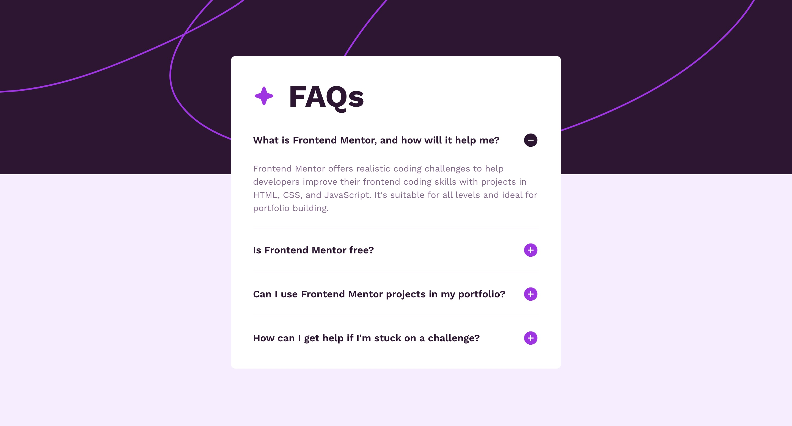

# Frontend Mentor - FAQ accordion solution

This is a solution to the [FAQ accordion challenge on Frontend Mentor](https://www.frontendmentor.io/challenges/faq-accordion-wyfFdeBwBz). Frontend Mentor challenges help you improve your coding skills by building realistic projects.

## Table of contents

-   [Overview](#overview)
    -   [The challenge](#the-challenge)
    -   [Screenshot](#screenshot)
    -   [Links](#links)
-   [My process](#my-process)
    -   [Built with](#built-with)
    -   [What I learned](#what-i-learned)
    -   [Continued development](#continued-development)
-   [Author](#author)

## Overview

### The challenge

Users should be able to:

-   Hide/Show the answer to a question when the question is clicked
-   Navigate the questions and hide/show answers using keyboard navigation alone
-   View the optimal layout for the interface depending on their device's screen size
-   See hover and focus states for all interactive elements on the page

### Screenshot



### Links

-   Solution URL: [Solution URL](https://github.com/Joshk7/faq-accordion)
-   Live Site URL: [Live Site URL](https://faq-accordion-ashy-one.vercel.app)

## My process

### Built with

-   Semantic HTML5 markup
-   CSS custom properties
-   Flexbox
-   CSS Grid
-   Mobile-first workflow

### What I learned

I wanted to solve this challenge without JavaScript and found that it was challenging until I thought about how to layout semantic html that made sense for this particular case. Notably, I used radio buttons since only one item can be checked at a time. The accordion content is a list of radio buttons contained by labels that a user can click:

```html
<li class="item">
    <label class="item__label">
        <h2 class="item__label--header">
            What is Frontend Mentor, and how will it help me?
        </h2>
        <input class="radio" name="faq" type="radio" checked />
    </label>
    <p class="item__description">
        Frontend Mentor offers realistic coding challenges to help developers
        improve their frontend coding skills with projects in HTML, CSS, and
        JavaScript. It's suitable for all levels and ideal for portfolio
        building.
    </p>
</li>
```

Once I established this structure, I added styles to the paragraph tag when the parent contains or :has a checked radio button in it.

```css
.item__description {
    max-height: 0;
    overflow: hidden;
    transition: 350ms;
    font: normal 0.875rem/1.5 "Work Sans";
    color: var(--pale-purple);
}

.item__label:has(.radio:checked) + .item__description {
    margin-top: 1.5rem;
    max-height: 6.25rem; /* Adjust as needed */
    overflow: hidden;
    transition: 350ms;
}
```

### Continued development

I could further polish the transition times so that opening an accordion item has a smoother transition.

## Author

-   Website - [Joshua Kahlbaugh](https://joshuakahlbaugh.pages.dev)
-   Frontend Mentor - [@Joshk7](https://www.frontendmentor.io/profile/Joshk7)
